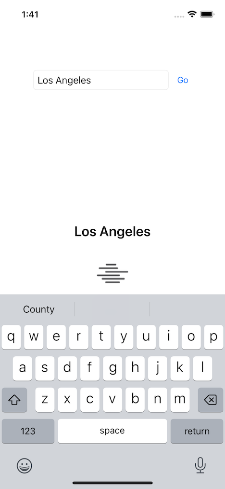

# weatherapp

Swift-based iOS weather app is designed with a modular architecture for scalability and
 maintainability.

- MVVM architecture with separation of concerns
- Integrates CoreLocation to provide real-time weather updates based on the user's location.
- Custom networking layer efficiently handles API interactions, reliable data fetching.
- Protocols for dependency injection for unit testing and flexibility in component management.
- UIKit, programmatic UI AutoLayout
- OpenWeatherMap API to fetch current weather data.

## Components

### Weather Feature

1. **WeatherFeatureCoordinator**: Manages navigation and flow control within the weather feature, integrates with app.
2. **DefaultWeatherFeatureFactory**: A factory class to create instances of the main components and dependencies required for weather feature.
3. **WeatherViewModel**: Main view model that handles business logic and data fetching for the weather feature.
4. **WeatherWebService**: Network requests to weather API and fetch required weather data.
5. **WeatherRemoteRepository**: Data source for the view model and provides weather data fetched from WeatherWebService.
6. **WeatherData**: Codable model representing the structure of the weather data fetched from the API.
7. **WeatherViewController, WeatherView, WeatherCardView**: The main view controller and views that display the weather data and handle interactions, search.
8. Unit Tests, Mocks

## Screens

## Author

krishna
